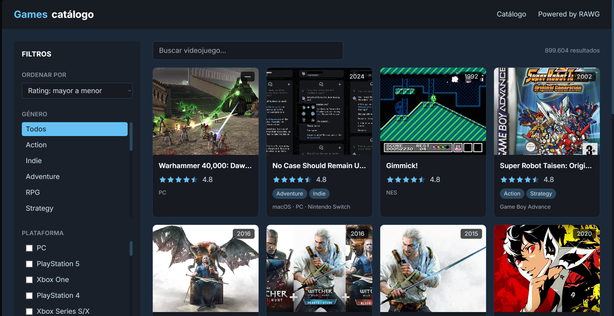
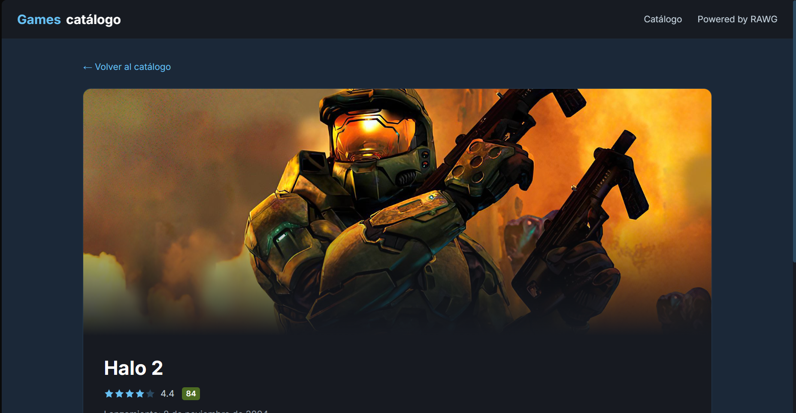

# Games Catálogo

Aplicación web desarrollada con React, TypeScript y Tailwind CSS para explorar videojuegos utilizando la RAWG Video Games Database API. Permite buscar, filtrar y consultar información detallada de más de 500,000 títulos mediante una interfaz inspirada en plataformas de distribución digital.

---

## Descripción

Games Catálogo consume la API de RAWG para mostrar información actualizada sobre videojuegos. La aplicación ofrece búsqueda en tiempo real, filtros por género y plataforma, ordenamiento de resultados y una vista detallada de cada juego con imágenes, descripción, puntuaciones y plataformas disponibles.

Este proyecto fue desarrollado con el objetivo de practicar el consumo de APIs REST, la construcción de interfaces modernas con React y la organización de aplicaciones mediante componentes reutilizables y TypeScript.

---

## Características

- Exploración de videojuegos mediante la API de RAWG
- Búsqueda por nombre
- Filtros por género, plataforma y año
- Ordenamiento por popularidad, nombre y fecha de lanzamiento
- Vista detallada de cada videojuego
- Información de plataformas, géneros y puntuaciones
- Diseño responsive inspirado en Steam
- Manejo de estados de carga y errores
- Arquitectura basada en componentes reutilizables

---

## Vista previa

### Página principal



### Detalle del videojuego



---

## Tecnologías

| Tecnología | Descripción |
|------------|-------------|
| React | Biblioteca para la interfaz de usuario |
| TypeScript | Tipado estático |
| Vite | Herramienta de desarrollo |
| Tailwind CSS | Framework CSS |
| React Router | Navegación entre páginas |
| RAWG API | Base de datos de videojuegos |

---

## Estructura del proyecto

```
catalogo-videojuegos/
│
├── src/
│   ├── components/
│   ├── hooks/
│   ├── pages/
│   ├── services/
│   ├── types/
│   ├── utils/
│   └── index.css
│
├── public/
├── package.json
├── vite.config.ts
└── README.md
```

---

## Instalación

Clonar el repositorio

```bash
git clone https://github.com/Mau12701/catalogo-videojuegos.git
```

Entrar al proyecto

```bash
cd catalogo-videojuegos
```

Instalar dependencias

```bash
npm install
```

Crear el archivo `.env`

```env
VITE_RAWG_API_KEY=TU_API_KEY
```

Ejecutar

```bash
npm run dev
```

La aplicación estará disponible en:

```
http://localhost:5173
```

---

## API utilizada

RAWG Video Games Database API

https://rawg.io/apidocs

Principales recursos utilizados:

- Games
- Genres
- Platforms
- Screenshots

---

## Aprendizajes

Durante el desarrollo de este proyecto se aplicaron los siguientes conceptos:

- Consumo de APIs REST
- Manejo de estados en React
- TypeScript para tipado de datos
- Custom Hooks
- React Router
- Componentes reutilizables
- Manejo de errores
- Filtros dinámicos
- Paginación
- Responsive Design

---

## Autor

Mauricio Escobar Sanchez

GitHub

https://github.com/Mau12701

Correo

mauriescobar127@outlook.com

---

Proyecto desarrollado con fines educativos y para portafolio profesional.
=======
# React + Vite

This template provides a minimal setup to get React working in Vite with HMR and some Oxlint rules.

Currently, two official plugins are available:

- [@vitejs/plugin-react](https://github.com/vitejs/vite-plugin-react/blob/main/packages/plugin-react) uses [Oxc](https://oxc.rs)
- [@vitejs/plugin-react-swc](https://github.com/vitejs/vite-plugin-react/blob/main/packages/plugin-react-swc) uses [SWC](https://swc.rs/)

## React Compiler

The React Compiler is not enabled on this template because of its impact on dev & build performances. To add it, see [this documentation](https://react.dev/learn/react-compiler/installation).

## Expanding the Oxlint configuration

If you are developing a production application, we recommend using TypeScript with type-aware lint rules enabled. Check out the [TS template](https://github.com/vitejs/vite/tree/main/packages/create-vite/template-react-ts) for information on how to integrate TypeScript and Oxlint's TypeScript related rules in your project.

